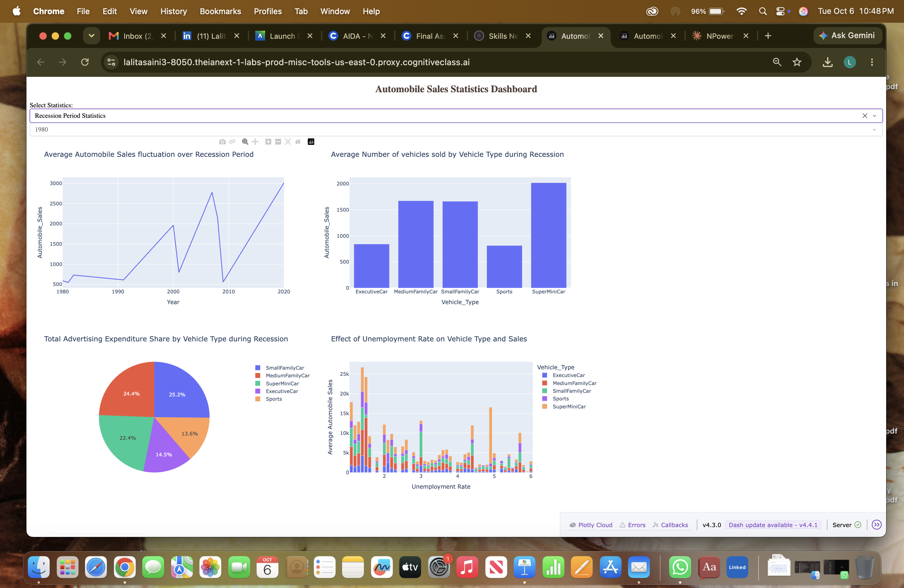
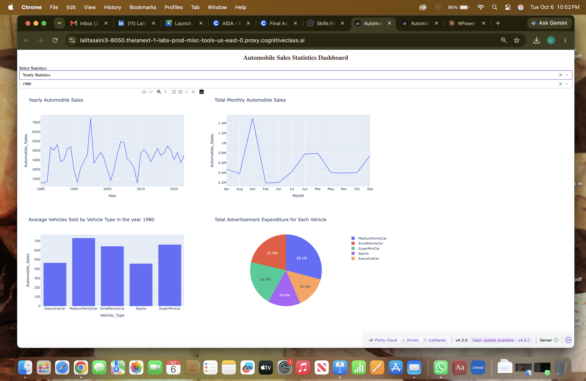

#    - `automobile-sales-analysis-during-recessions.ipynb`: Part 1 visualizations

## Overview
This project analyzes historical automobile sales data (1980–2023) to understand
how economic recessions affect car sales. Using Python (Pandas, Matplotlib,
Seaborn, Folium), I compared recession and non-recession periods across vehicle
types, advertising spend, GDP, unemployment, vehicle price, and seasonality.
This is the final project for IBM's Data Visualization with Python course.

## Key Findings
- **Sales drop sharply in recessions:** average sales were about 3,700 units in
  non-recession periods vs. about 1,400 during recessions, roughly 60% lower.
- **Luxury cars are hit hardest:** Executive and Sports car sales fell by about
  75% during recessions, while SuperMiniCars held up best. Buyers switch to
  cheaper vehicles.
- **Price matters in downturns:** during recessions, most sales came from
  vehicles priced under $40,000.
- **Advertising is cut back:** only 17.3% of total advertising spend happened
  during recessions, with most of it going to Small and Medium Family Cars.
- **Strong seasonality:** December has the highest sales, with smaller peaks in
  March and April.
## Interactive Dashboard (Part 2)
Built with Plotly Dash, with dropdowns to switch between
Recession Period Statistics and Yearly Statistics.

## Files
- `automobile_sales_analysis.ipynb`: Part 1 visualizations
- `Dashboard_app.py`: Part 2 Dash app
